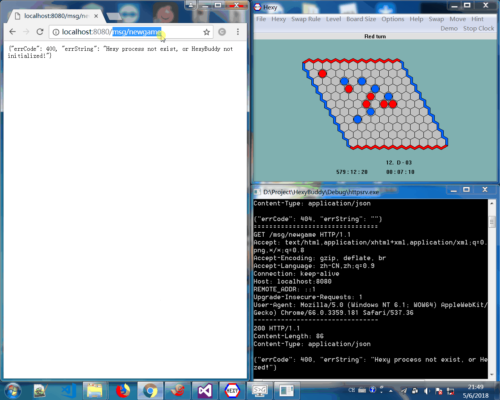

# HexyBuddy

## 简介

HexyBuddy 是一个通过读取内存和模拟点击等方式控制后台运行的 Hexy 的程序。

HexyBuddy 可以完成如下功能：
* 寻找后台运行中的 Hexy 程序
* 读取 Hexy 程序的棋盘状态（落子数、落子记录、棋盘尺寸和是否分出胜负 等信息）
* 通过模拟点击事件在 Hexy 棋盘指定位置上落子
* 模拟 Hexy 菜单消息事件（重新开始、设置 AI 难度、改变棋盘尺寸和要求 Hexy 落子 等控制命令）
* 显示 Hexy 对当前局面的估值


*Warning:* 本程序设计初衷是为 Hexy 提供一个与其他程序自动博弈的接口。请勿用 watchcat 等工具隐藏 Hexy 用于其他非正当用途。


## 演示




## 工程结构

### 目录结构

- HexyBuddy/
	- cpp-httplib/
	- json11/
	- hexybuddy/
	- httpsrv/
	- HexyBuddy.sln/

### 各模块功能简介

* hexybuddy

静态库，核心功能模块，可供外部调用。
提供棋盘内存信息读取，模拟点击，控制消息传递等功能。
**错误多以异常的形式抛出，直接调用注意捕获异常**。
使用需包含头文件 hexybuddy.h

* httpsrv

可执行程序，HTTP 服务。
调用 hexybuddy 的接口并进行了异常处理，可以安全的控制 Hexy 程序。
所有支持 GET/POST 两种请求方法。
**推荐使用此程序作为控制 Hexy 的接口**，而不是直接调用 hexybuddy。

* cpp-httplib

HTTP 库，header-only，供 httpsrv 调用。

* json11

静态库，为 httpsrv 提供 JSON 序列化/反序列化支持。

## 编译运行

1. 使用 Visual Studio 2015 或以上版本打开 "HexyBuddy.sln"
2. 设置 httpsrv 为启动项
3. 点击工具栏那个绿色的小三角编译运行程序
4. 运行一个 Hexy
5. 打开 Chrome 访问 http://localhost:8080/init
6. 如果页面显示：{"errCode": 200, "errString": "OK"}，说明运行成功。
7. 参考协议文档通过浏览器提交请求控制 Hexy。Have fun ：）


## 协议及调用规范

### 总体介绍

httpsrv 默认监听本机的 **8080** 端口的 HTTP 请求，运行前需确保端口未被占用（也可修改 "/HexyBuddy/httpsrv/main.cpp" 修改监听端口）。

为方便浏览器访问，所有请求都提供 GET 方法的支持。
需要参数的接口也支持 POST 方法，参数以 JSON 格式传入。

服务器阻塞处理后以 JSON 格式返回处理结果。
如：访问 http://localhost:8080/init 初始化 HexyBuddy 并寻找正在运行的 Hexy 程序。
若成功则返回：
```json
{
	"errCode": 200,
	"errString": "OK"
}
```
或失败返回：
```json
{
	"errCode": 400,
	"errString": "Fail, Hexy process not found."
}
```

### 支持请求列表

| 方法 | URL   |  描述  |
| :---:   | :----------  | :---------- |
| GET | /init | 初始化并寻找正在运行的 Hexy 实例 |
| GET/POST | /set/piece | 在 Hexy 当前棋盘上落子 |
| GET/POST | /set/wait | 在 Hexy 当前棋盘上落子,阻塞等待并返回 Hexu 落子位置 |
| GET | /get/rec | 获取 Hexy 当前棋盘上的所有落子记录 |
| GET | /get/pawnnum | 读取棋盘上现有棋子数 |
| GET | /get/boardsize | 读取棋盘尺寸 |
| GET | /get/gameoverflag | 读取棋局是否结束 |
| GET | /msg/newgame | 清理棋盘并重新开始 |
| GET | /msg/exit | 退出 Hexy |
| GET | /msg/hexy/on | Hexy AI 自动落子开关打开 |
| GET | /msg/hexy/off | Hexy AI 自动落子开关关闭 |
| GET | /msg/swap/on | 启用 swap 规则 |
| GET | /msg/swap/off | 停用 swap 规则 |
| GET | /msg/level/beginner | 弱智的 AI |
| GET | /msg/level/intermediate | 普通的 AI |
| GET | /msg/level/advanced | 很强的 AI |
| GET | /msg/level/expert | 牛逼的 AI |
| GET/POST | /msg/size | 设置棋盘尺寸 |
| GET | /msg/shape/default | 重置棋盘形状（FLAT I） |
| GET | /msg/toggle/coord | 切换坐标显示开关 |
| GET | /msg/toggle/numbering | 切换棋子编号显示开关 |
| GET | /msg/toggle/guess | 切换猜测显示开关 |
| GET | /msg/toggle/sound | 切换落子音效播放开关 |
| GET | /msg/toggle/random | 切换随机搜索开关 |
| GET | /msg/toggle/clock | 切换计时开关 |
| GET | /msg/move | 由 Hexy 进行下一步落子 |
| GET | /msg/hint | 由 Hexy 搜索下一步落子并提示 |
| GET | /msg/demo | Hexy 自博弈 |
| GET/POST | /msg/origin | 向 Hexy 发送自定义控制命令（参照 msgdef.h 文件） |

### 一些重协议的讲解

#### 0. 初始化 Hexy

关联 HexyBuddy 和 后台运行的 Hexy（有多个 Hexy 实例存在则关联进程快照中靠前的实例）
启动程序 或 更换 Hexy 实例后都需要手动请求。

##### 1）请求（GET 方法）：http://localhost:8080/init

##### 2）响应：

```json
{
	"errCode": 200,
	"errString": "OK"
}
```

#### 1. 落子

控制 Hexy 在指定坐标落子。

##### 1）请求（GET 方法）：http://localhost:8080/set/piece?col=0&row=5

- 参数说明：
	- col：落子位置列坐标（0 <= col < boardsize）
	- row：落子位置行坐标（0 <= row < boardsize）

##### 2）请求（POST 方法）：http://localhost:8080/set/piece

- 请求体：
```json
{
	"col": 0,
	"row": 5
}
```

- 参数说明：
	- col：落子位置列坐标（0 <= col < boardsize）
	- row：落子位置行坐标（0 <= row < boardsize）

##### 2）响应：

```json
{
	"errCode": 200,
	"errString": "OK"
}
```

- 返回值说明：
	- errCode：200 表示成功，否则为失败（坐标越界、已存在棋子、已分出胜负和 HexyBuddy 未初始化都可能导致失败）
	- errString：具体错误原因

#### 2. 读取落子记录

读取 Hexy 棋盘上的棋盘状态。

##### 1）请求（GET 方法）：http://localhost:8080/get/rec

##### 2）响应：

```json
{
	"errCode": 200,
	"errString": "OK",
	"records": [
		{"col": 6, "row": 3},
		{"col": 4, "row": 4},
		{"col": 2, "row": 7},
		{"col": 4, "row": 8},
		{"col": 5, "row": 8},
		{"col": 8, "row": 4},
		{"col": 6, "row": 6},
		{"col": 4, "row": 6}
	]
}
```

- 返回值说明：
	- records：按照**落子顺序**列出的落子记录数组

#### 3. 读取棋盘尺寸

读取 Hexy 棋盘尺寸。

##### 1）请求（GET 方法）：http://localhost:8080/get/boardsize

##### 2）响应：

```json
{
	"errCode": 200,
	"errString": "OK",
	"boardsize": 11
}
```

- 返回值说明：
	- boardsize：棋盘尺寸

#### 4. 读取棋局是否结束

读取判断 Hexy 棋局是否分出胜负

##### 1）请求（GET 方法）：http://localhost:8080/get/gameoverflag

##### 2）响应：

```json
{
	"errCode": 200,
	"errString": "OK",
	"gameover": false
}
```

- 返回值说明：
	- gameover：是否分出胜负

#### 5. 读取棋盘上现有棋子数

读取棋盘上现有棋子数。

##### 1）请求（GET 方法）：http://localhost:8080/get/pawnnum

##### 2）响应：

```json
{
	"errCode": 200,
	"errString": "OK",
	"num": 8
}
```

- 返回值说明：
	- num：Hexy 棋盘上现有棋子数

#### 6. 重新开始

清理棋局并重新开始。

##### 1）请求（GET 方法）：http://localhost:8080/msg/newgame

##### 2）响应：

```json
{
	"errCode": 200,
	"errString": "OK"
}
```

#### 7. 设置棋盘尺寸

设置棋盘尺寸，如果与之前设定不同，则重新开始。

##### 1）请求（GET 方法）：http://localhost:8080/msg/size?size=11

- 参数说明：
	- size：棋盘尺寸

##### 2）请求（POST 方法）：http://localhost:8080/msg/size

- 请求体：
```json
{
	"size": 11
}
```

- 参数说明：
	- size：棋盘尺寸

##### 3）响应：

```json
{
	"errCode": 200,
	"errString": "OK"
}
```

#### 8. 打开或关闭 Hexy AI 自动落子

打开或关闭 Hexy AI 自动落子功能。

##### 1）请求（GET 方法）：http://localhost:8080/msg/hexy/on 或http://localhost:8080/msg/hexy/off

##### 2）响应：

```json
{
	"errCode": 200,
	"errString": "OK"
}
```

#### 9. 由 Hexy 进行下一步落子

由 Hexy 的 AI 进行下一步落子。不阻塞，可以通过请求 http://localhost:8080/get/pawnnum 监视落子数，来判断 Hexy 是否已完成落子。

##### 1）请求（GET 方法）：http://localhost:8080/msg/move

##### 2）响应：

```json
{
	"errCode": 200,
	"errString": "OK"
}
```
